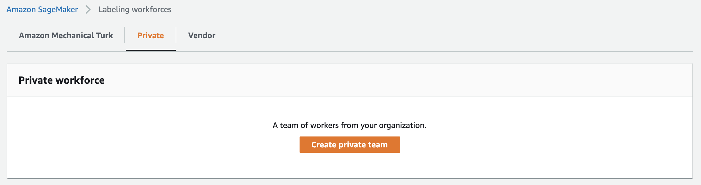
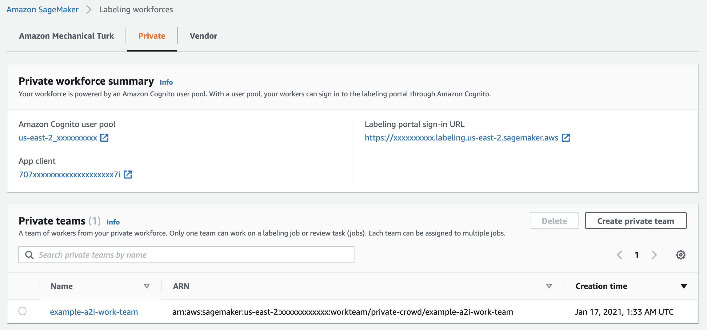

## 0-Prerequsites

**Supported Regions (January 2021)**  
Amazon Rekognition Custom Labels is available in US East (N. Virginia), US East (Ohio), US West (Oregon), Europe (Ireland), Asia Pacific (Singapore), Asia Pacific (Sydney), Asia Pacific (Tokyo), and Asia Pacific (Seoul). [Latest](https://docs.aws.amazon.com/general/latest/gr/rekognition.html)

1. Select one of the Rekognition Custom Labels supported regions from above to deploy this demo.
2. Verify Amazon SageMaker Labeling Workforces Setup  
As part of the CloudFormation deployment process, we can optionally deploy an **Amazon SageMaker Private Workforce** with an associated **Amazon Cognito User Pool**. However since you can only have one private workforce per region, we cannot deploy over an existing private workforce. To verify whether you have a private workforce already, go to [Amazon SageMaker Label workforces](https://console.aws.amazon.com/sagemaker/groundtruth#/labeling-workforces), select the region that you want to use, and then select the **Private** tab. You should see one of three possible setups below:  
  - No Private Workforce
  
  When you are prompted to enter a *A2IPrivateTeamName* in the CloudFormation template, leave it blank. We will deploy a private workforce and a private team for you.

  - Private Workforce without Private Teams  
  
  Click **Create private team** to create a private team. When you are prompted to enter a *A2IPrivateTeamName* in the CloudFormation template, enter your newly created Private Team name.

  - Private Workforce with Private Teams
  
  You can use your existing Private Team or create a new one as instructed above. When you are prompted to enter a *A2IPrivateTeamName* in the CloudFormation template, enter your newly created Private Team name.

3. Initialize Rekognition Custom Labels  
Before you can use Rekognition Custom Labels you need to initialize it for that region. Go to [Amazon Rekognition Customs Label](https://console.aws.amazon.com/rekognition/custom-labels) and select **Projects** from the menu on the left.
  - If you see the Project screen with or without projects, then your region is initialized.
  - If you see a message "First time set up", follow the instruction to create the S3 bucket. We won't use the default bucket in this demo but it is part of the required initialization process.

Next Step: [Deployment](../1-Deployment/)
