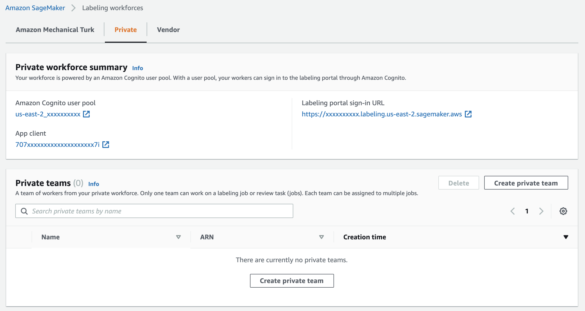

## 0 Prerequsites

**Supprted Regions (June 2021)**  
[Amazon Rekognition Custom Labels](https://aws.amazon.com/rekognition/custom-labels-features/) is available in US East (N. Virginia), US East (Ohio), US West (Oregon), Europe (Ireland), Europe (Ireland), Europe (London), Europe (Frankfurt), Asia Pacific (Mumbai), Asia Pacific (Singapore), Asia Pacific (Sydney), Asia Pacific (Tokyo), Asia Pacific (Seoul). [Latest](https://docs.aws.amazon.com/general/latest/gr/rekognition.html).

- Have an AWS account with [AWS Identity and Access Management](https://aws.amazon.com/iam/) (IAM) permissions to launch the provided [AWS CloudFormation](https://aws.amazon.com/cloudformation/) template.
- Decide on one of the Rekognition Custom Labels supported Regions in which to deploy this solution.
- As part of the CloudFormation deployment process, you can optionally deploy an [Amazon SageMaker Ground Truth](https://aws.amazon.com/sagemaker/groundtruth/) private workforce with an associated [Amazon Cognito](https:///aws.amazon.com/cognito/) user pool. Because you can only have one private workforce per Region, you can’t deploy over an existing private workforce. To verify whether you have a private workforce already, go to the **Labeling workforces** page on the Amazon SageMaker console, choose the Region that you want use, and choose the **Private tab**. You should see three possible setups:

  - **No Private workforce** - In this setup, SageMaker deploys a private workforce and a private team for you. When you’re prompted to enter a value for A2IPrivateTeamName in the CloudFormation template, leave it blank.
  

  - **Private workforce without private teams** – In this setup, you need to create a private team first. Choose **Create private team** and follow the instructions to create a team. When you’re prompted to enter a value for A2IPrivateTeamName in the CloudFormation template, enter your newly created private team name.
  

  - **Private workforce with private teams** – In this setup, you can use your existing private team or create a new one. We recommend that you create a new private team. When you’re prompted to enter a value for A2IPrivateTeamName in the CloudFormation template, enter your private team name.
  

- You need to initialize Rekognition Custom Labels for your selected Region before you can use Rekognition Custom Labels. On the Rekognition Custom Labels console, choose **Projects** in the navigation pane and take one of the following actions:
 - If you see the **Projects** page with or without projects, then your Region is initialized.
 - If you’re prompted with a message for first-time setup, follow the instructions to create the default [Amazon Simple Storage Service](https://aws.amazon.com/s3) (Amazon S3) bucket. We don’t use the default S3 bucket with this solution, but it’s part of the Rekognition Custom Labels initialization process.

Next Step: [Deployment](../1-Deployment/)
