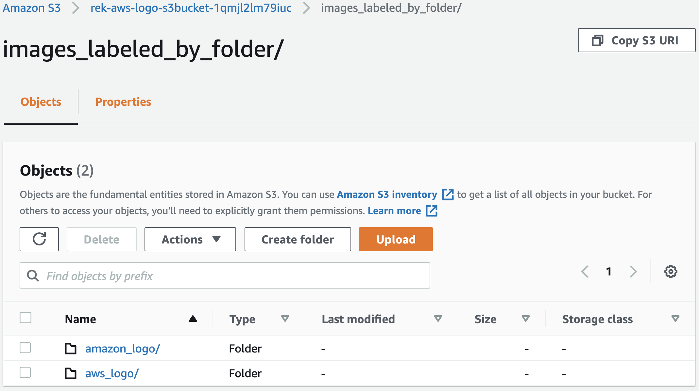

## 3 Train and deploy your model

For this demo, we want to build an [Amazon Rekognition Custom Labels](https://aws.amazon.com/rekognition/custom-labels-features/) model for brand detection with training images. As we start using the model, we capture inference images with low detection confidence for human labeling. Captured images that can be properly labeled are added to the training images for model training as part the of continuous model improvement process.

Rekognition Custom Labels supports two methods of labeling datasets: [object-level labeling](https://docs.aws.amazon.com/rekognition/latest/customlabels-dg/cd-manifest-files-object-detection.html) and [image-level labeling](https://docs.aws.amazon.com/rekognition/latest/customlabels-dg/rv-assign-labels.html). This demo uses the `image-level labeling` method.

We use Amazon and AWS logos for our initial training images. The images are located in the `sample-images` folder. We use the folder name as the label such that images in the **amazon_logo** and **aws_logo** folders are labeled `amazon_log` and `aws_logo`, respectively.

In this section, we walk you through the steps to add training images to [Amazon Simple Storage Service](https://aws.amazon.com/s3) (Amazon S3)  and explain how the automatic model training process works.

1. On the [Amazon S3](https://s3.console.aws.amazon.com/s3/home) console, choose the bucket with the name similar to `yourstackname-s3bucket-esxhty0wyhqu`.  and select the bucket with name similar to "yourstackname-s3bucket-esxhty0wyhqu". You should see 5 folders:
  - a2i-human-loop-data/
  - evaluation/
  - images_for_detection/
  - images_labeled_by_folder/
  - manifests/
2. Choose the folder `images_labeled_by_folder`.
3. Choose **Upload** and then **Add folder**.
4. When prompted to select images from your computer, choose the `amazon_logo` folder, not the images inside the folder.
5. Repeat these steps to add the `aws_logo` folder.
6. Choose **Upload**.

You should now have two folders and 10 images, as shown in the S3 `images_labeled_by_folder` folder.

At this point, we have 10 training images, which meets the minimum of 10 new images (as currently set in Parameter Store) to qualify for new model training. When the [Amazon EventBridge](https://aws.amazon.com/eventbridge/) schedule rule triggers to invoke the [AWS Step Functions](https://aws.amazon.com/step-functions/) state machine to check for new training, it initiates a full model training and deployment process. Because the current schedule rule polling frequency is 600 minutes, the schedule rule doesn’t trigger in the time frame of this demo. We manually trigger the schedule rule for the sole purpose of this demo only.

7.	On the [Amazon Parameter Store](https://console.aws.amazon.com/systems-manager/parameters) console, choose the `Enable-Automatic-Training parameter`.
8.	Choose **Edit**.
9.	Update the value to `false` and choose **Save changes**.
10.	Choose **Edit** again.
11.	Update the value back to `true` and choose **Save changes**.

This resets the schedule rule to initiate an event to send to Step Functions to check the conditions for new model training. You should also receive three separate emails, two indicating that you updated a parameter and one indicating that automatic training is checked.

Wait for the model training and deployment to complete. This should take approximately 1 hour. You should receive periodic emails on model training and deployment status. The model is deployed when you receive an email with the message “Status: RUNNING.”

12. Choose the parameter `For-System-Use-Only` on the Parameter Store console.

The `previous_trained_images` value should be 0 as Rekognition Custom Labels has not completed the training yet.

13.	As an optional step, go to the **Projects** page on the Rekognition Custom Labels console to review the model status and training details.

If you’re redirected to a different Region, switch to the correct Region.

14.	As another optional step, choose the state machine on the Step Functions console.

You should see a list of runs and associated statuses.

15.	Choose any run to review the details and choose **Graph inspector**.

The state machine records every run so you can always refer back to troubleshoot issues.

Now that your initial model has been trained and deployed, let’s check the `previous_trained_images` value again. The value should be updated automatically to 10, which represents the 10 images you used in this initial model training. On successful model training, an [AWS Lambda](https://aws.amazon.com/lambda/) function updates the value to the total number of images used for training.

For new model training to begin, it needs to meet three conditions in the following order:

1.	Automatic training is enabled in Parameter Store. If disabled, the schedule rule isn’t triggered to check the training.
2.	The schedule rule triggers next to check for training based on the set frequency. Because the frequency is current set at 600 minutes, the schedule rule doesn’t trigger in the timeline of this demo.
3.	When checking for training, the number of new images added since the last successful training must be greater than the minimum untrained images (currently set at 10) for new training to start. Because you trained 10 images in the initial training, you need 10 new labeled images, for a total of 20 images.

Next Step: [4-Custom-Labels-Detection](../4-Custom-Labels-Detection/)
