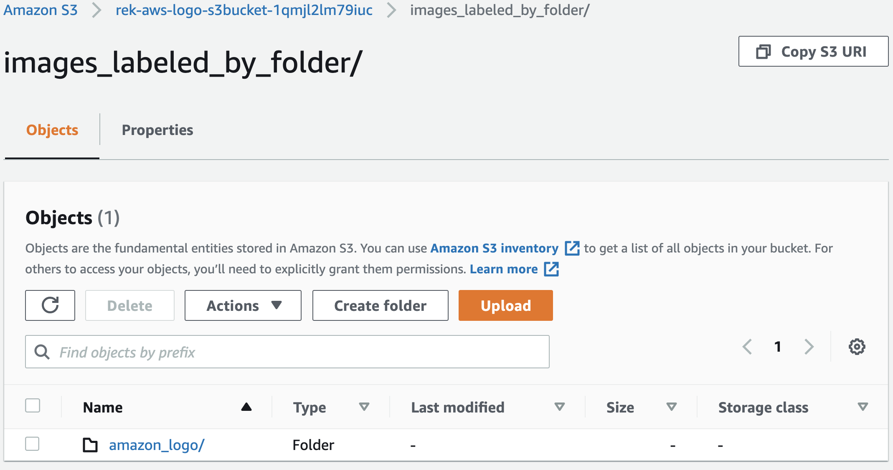

## 3-Model-Training

**Amazon Rekognition Custom Labels Model Training**  
In this section we will walk through the steps to train and deploy a custom labels model. We will use the image folder name as label and the Lambda functions will create the training manifest accordingly. We will be using Amazon, AWS, and WholeFood logos to the model training and detection demo. The images are located in the "sample-images" folder.

1. Go to [Amazon S3](https://s3.console.aws.amazon.com/s3/home) and select the bucket with name similar to "yourstackname-s3bucket-esxhty0wyhqu". You should see 5 folders:
  - a2i-human-loop-data/
  - evaluation/
  - images_for_detection/
  - images_labeled_by_folder/
  - manifests/
2. Select the "images_labeled_by_folder/" folder and then **Upload**.
3. Select **Add folder**. When prompted, select the "amazon_logo" folder from your local computer. You should have something like below when done. At this point we have a total of 5 training images in the designated S3 folder. Since we set the polling frequency to 600 minutes, the scheduled rule will not fire to check for automatic model training. We will manually trigger the rule for the purpose of this demo only.

  

4. Go to the [AWS Systems Manager Parameter Store](https://console.aws.amazon.com/systems-manager/parameters) and select the *Enable-Automatic-Training* parameter. Click **Edit**, update the value to *false*, and then click **Save changes**. Repeat the steps to update it back to *true* again. This will trigger the state machine to invoke a Lambda to disable and then enable the scheduled rule, which will trigger the state machine to check for new training. You should also have received 3 separate emails, two indicating that you updated a parameter and one indicating that automatic training check failed to meet training criteria. That's because we only have 5 images total while the minimum is set at 10 in the parameter store.

4. While still in the **Parameter Store**, review the value "previous_trained_images" in "For-System-Use-Only". The value should be "0" because we have not successfully completed any training.

5. Go to [AWS Step Functions](https://console.aws.amazon.com/states/) and select the State Machine for this demo. You should see a list of executions and the associated statuses. Select any execution and review the details and the **Graph inspector**. The state machine records every execution so that you can always refer back to troubleshoot issues.

6. Repeat Steps 2 through 5 by adding the "aws_logo" folder. When done we should have folders and 10 images total to qualify for automatic training.

  

7. Wait for the model training and deployment to complete. This should take approximately one hour. You will receive periodic emails about the status of the model training and deployment.

8. Review the value "previous_trained_images" in "For-System-Use-Only". The value should be "10" now. On successful model training, a Lambda function updates the value to the total number of images used for training. Since the "Minimum-Untrained-Images" is currently set at 10, you will need a minimum of 20 images in the S3 "images_labeled_by_folder/" another automatic training to start.

8. (Optional) Go to [Amazon Rekognition Custom Labels Projects](https://console.aws.amazon.com/rekognition/custom-labels#/projects) to review the model status and training details. If you are redirected to a different region, select the correct region.

9. (Optional) Go to [AWS Step Functions](https://console.aws.amazon.com/states/) to review the state machine executions.

Next Step: [4-Custom-Labels-Detection](../4-Custom-Labels-Detection/)
