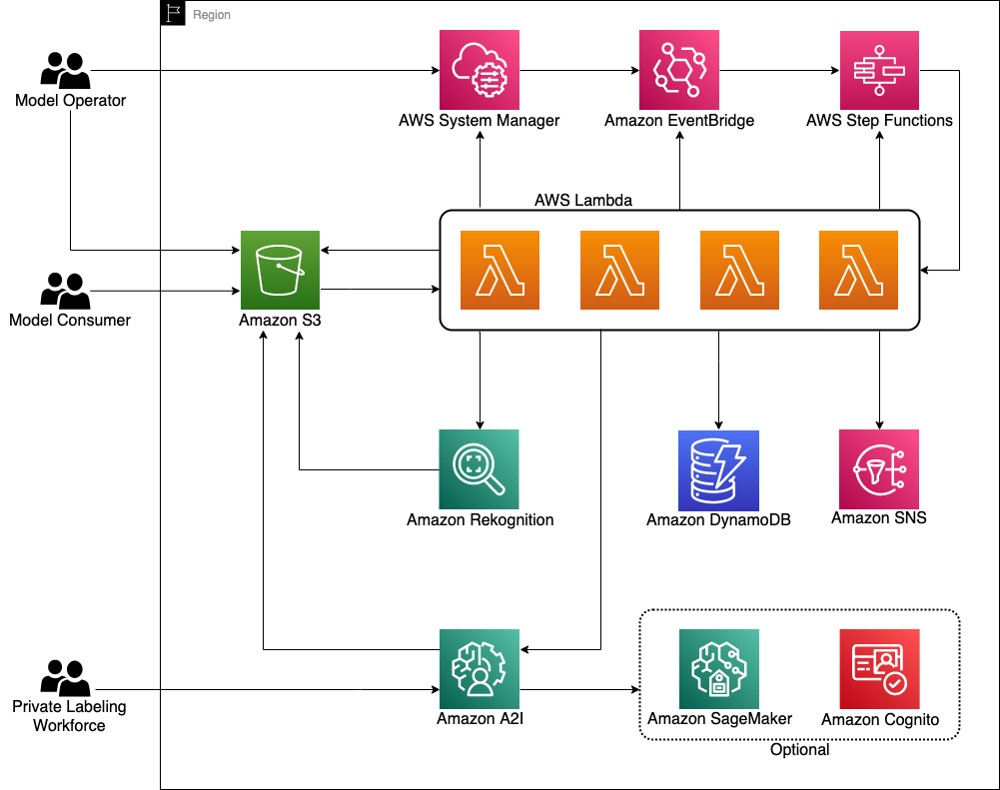

## Automate continuous model improvement with Amazon Rekognition Custom Labels and Amazon A2I

In this sample we explain how to implement an automated [Amazon Rekognition Custom Labels](https://aws.amazon.com/rekognition/custom-labels-features/) and [Amazon Augmented AI](https://aws.amazon.com/augmented-ai/) (Amazon A2I) ML workflow that can provide continuous model improvement without requiring ML expertise.

With Rekognition Custom Labels, you can easily build and deploy ML models to identify custom objects that are specific to your business domain. Because Rekognition Custom Labels is built off [Amazon Rekognition](https://aws.amazon.com/rekognition/) trained models, you only need to use a small set of training images to build your custom model, without requiring any ML knowledge. When combined with Amazon A2I, you can quickly integrate a human review process into your ML workflow to capture and label images for model training. Amazon A2I provides the capability to integrate your own, contracted, or readily accessible [Amazon Mechanical Turk](https://www.mturk.com/) workforce to provide the human label review. With [AWS Step Functions](https://aws.amazon.com/step-functions/), you can create and run a series of checkpoints and event-driven processes to orchestrate the entire ML workflow with minimal upfront development. By incorporating [AWS Systems Manager Parameter Store](https://docs.aws.amazon.com/systems-manager/latest/userguide/systems-manager-parameter-store.html), you can use parameters as variables for Step Functions checkpoints to customize the behaviors of the ML workflow as needed.

### Solution overview
The objective of this ML workflow is to continuously improve the accuracy of the model based on inference performance. Specific to this Rekognition Custom Labels use case, inference images with a confidence level below the acceptance criteria need to be captured and labeled by a human workforce with Amazon A2I for new model training. The following diagram illustrates this ML workflow.

We add flexibility to this ML workflow by parameterizing some of the processes, as indicated in green in the preceding diagram. Parameterizing the workflow allows a model operator to make changes to the processes without requiring development. We provide seven configurable parameters:

1. **Enable-Automatic-Training:** A toggle switch to enable or disable automatic model training and deployment
2. **Automatic-Training-Poll-Frequency:** The minimum number of new images added since the last successful training for new training to start
3. **Minimum-Untrained-Images:** The minimum number of new images added since the last successful training for new training to start
4. **Minimum-F1-Score:** The minimum [F1 score](https://docs.aws.amazon.com/rekognition/latest/customlabels-dg/gs-step-evaluate-model.html) for a trained model to be acceptable for deployment
5. **Minimum-Inference-Units:** The minimum number of [inference units](https://docs.aws.amazon.com/rekognition/latest/customlabels-dg/rm-run-model.html) to use to deploy the model
6. **Minimum-Label-Detection-Confidence:** The [minimum confidence](https://docs.aws.amazon.com/rekognition/latest/customlabels-dg/detecting-custom-labels.html) of a detection to be considered acceptable
7. **Enable-A2I-Workflow:** A toggle switch to enable or disable the Amazon A2I human labeling process

We use Step Functions to deploy the following state machine for the orchestration of the workflow.

The state machine is event-driven and divided into four separate states:

1. The Parameter Store state is invoked by an [Amazon EventBridge](https://aws.amazon.com/eventbridge/) event pattern rule triggered by changes to certain parameters. When the model operator updates a parameter, the state machine invokes an [AWS Lambda](https://aws.amazon.com/lambda/) function to apply the changes to the impacted resources. For example, when the model operator updates the parameter Enable-Automatic-Training value to false, the state machine invokes a Lambda function to disable the automatic model training process.

2. The Rekognition Model state is invoked by an EventBridge scheduled rule on a polling schedule set by the model operator as a parameter. The state machine first evaluates whether new model training criteria, set by the model operator as a parameter, has been met before initiating training. When the training is complete, the state machine evaluates the F1 score of the new model against the acceptance criteria for model deployment. If the F1 score meets the acceptance criteria, the state machine initiates a blue-green deployment process. The blue-green deployment process includes starting the new model, updating the new model inference endpoint, and stopping the previous running model.

3. The Rekognition Detection state is invoked by an [Amazon Simple Storage Service](https://aws.amazon.com/s3/) (Amazon S3) PutObject event. When the model consumer uploads images to Amazon S3, a PutObject event invokes a Lambda function to redirect the required action to the state machine. The state machine invokes another Lambda function to perform the custom label detection. Next, the state machine evaluates the inference confidence against the confidence level set by the model operator as a parameter. The state machine initiates an Amazon A2I human review workflow if the inference confidence is below the criteria, provided that the Amazon A2I workflow is enabled.

4. The A2I Human Loop Data state is invoked by an S3 PutObject event. When the Amazon A2I human review workflow is complete, the output is stored in Amazon S3 by Amazon A2I by default. An S3 PutObject event invokes a Lambda function to redirect the required action to the state machine. The state machine invokes another Lambda function to evaluate the human loop response and place a copy of the initial image into an S3 folder corresponding to the evaluated label. This is the process in which new human-labeled images are added to the training dataset.

### Architecture overview
This solution is built on AWS [serverless](https://aws.amazon.com/serverless/) architecture. The architecture is shown in the following diagram.

  

We use Rekognition Custom Labels as the core ML service. A Recognition Custom Labels project is created as part the initial [AWS CloudFormation](https://aws.amazon.com/cloudformation/) deployment process. Creating, starting, and stopping project versions are performed automatically as orchestrated by the state machine backed by Lambda.

We use Amazon A2I to provide a human labeling workflow to label captured images during the inference process. A flow definition is created as part of the CloudFormation stack. An Amazon A2I human labeling task is generated by Lambda as part of the custom label detection process.

We optionally deploy an [Amazon SageMaker Ground Truth](https://aws.amazon.com/sagemaker/groundtruth/) private workforce and team, if none existed, as part of the CloudFormation stack. The human flow definition has a dependency for the Ground Truth private team to function.

We optionally deploy an [Amazon Cognito](https://aws.amazon.com/cognito/) user pool and app client, if none existed, as part of the CloudFormation stack. The Ground Truth private workforce has a dependency for the user pool and app client to function.

We use Parameter Store in two different ways. Firstly, we provide a set of seven single-value parameters for the model operator to use to configure the ML workflow. Secondly, we provide a JSON-based parameter for the system to use to store environmental variables and operational data.

We use two EventBridge rules to initiate Step Functions state machine runs. The first rule is based on a Systems Manager event pattern. The Systems Manager rule is triggered by changes to the Parameter Store and initiates the state machine to invoke a Lambda function to apply changes to the impacted resources. The second rule is a schedule rule. The schedule rule is triggered periodically to initiate the state machine to invoke a Lambda function to check for new model training.

We use a Step Functions state machine to orchestrate the ML workflow. The state machine initiates different processes based on events received from EventBridge and responses from Lambda. In addition, the state machine uses an internal process such as Wait to wait for model training and deployment to complete and Choice to evaluate for next tasks.

We use an S3 bucket and a set of predefined folders to store training and inference images and model artifacts. Each folder has a dedicated purpose. The model operator uploads new images to the folder images_labeled_by_folder for training, and the model consumer uploads inference images to the folder images_for_detection for custom label detection.

We use three different sets of Lambda functions:

- The first set consists of two Lambda functions that build the Rekognition Custom Labels project and Amazon A2I human flow definition. These two Lambda functions are only used initially as part of the CloudFormation stack deployment process.
- The second set of Lambda functions are invoked by the state machine to run Amazon Rekognition and Amazon A2I APIs, create a manifest file for training, collect labeled images for training, and manage system resources.
- The last set is a single Lambda function to redirect S3 PutObject events to the state machine.

We use [Amazon Simple Notification Service](https://aws.amazon.com/sns/) (Amazon SNS) as a communication mechanism to alert the model operator and model consumer of relevant model training and detection events. All SNS messages are published by the corresponding Lambda functions.

Next Step: [0-Prerequisites](./0-Prerequisites/)
